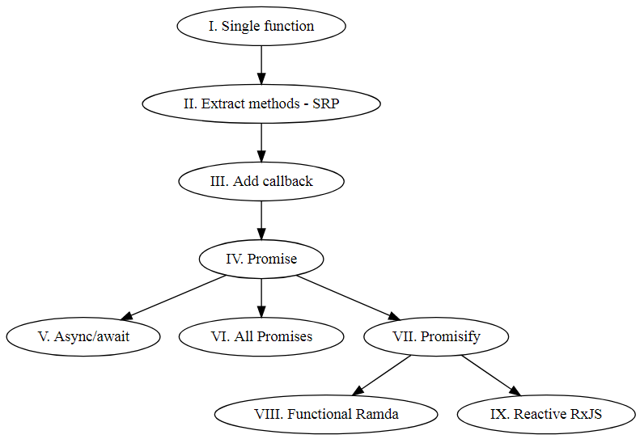

# Programming paradigms
*Programming paradigms in JavaScript - callbacks, Promise, async/await, promisify, functional (Ramda) and reactive (RxJS).*

You can run each example with `npm run index`, where *index* is from 1 to 9.

This code accompanies my [blog post](https://lukasznojek.com/blog/2019/06/programming-paradigms-in-javascript-callbacks-promise-async-await-promisify-functional-ramda-and-reactive-rxjs/) in which I describe evolution of callbacks and refactor code to find optimal maintainability and readability.
